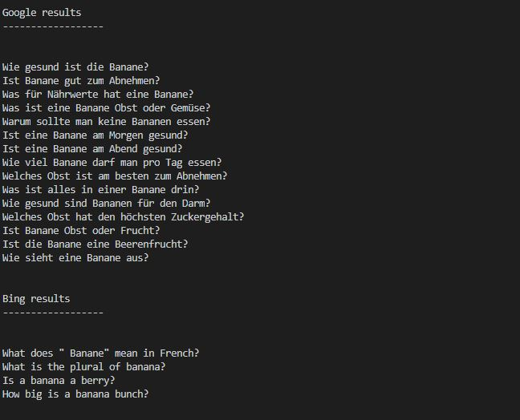

# people_also_asked
 Crawler to get information from bing and google about what people also asked

## Requirements

To install requirements.txt please run the following on the terminal.

`pip install requirements.txt`

## How to use it?

Just the file and anser the question `"keyword?"` with your desired keyword

## Result

The result is going to look like this 

